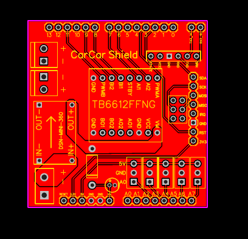
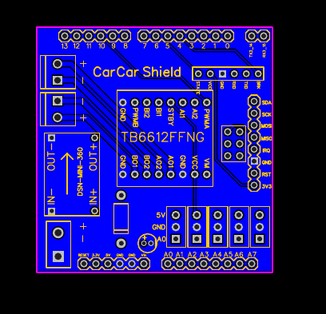
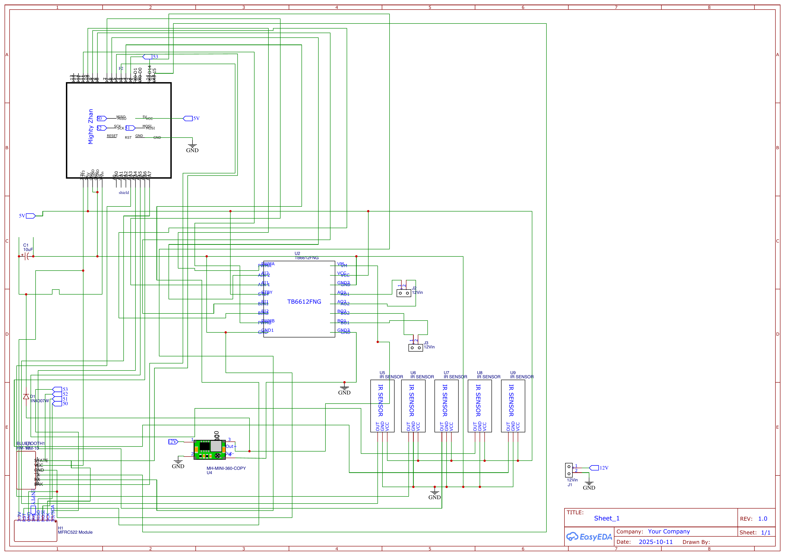
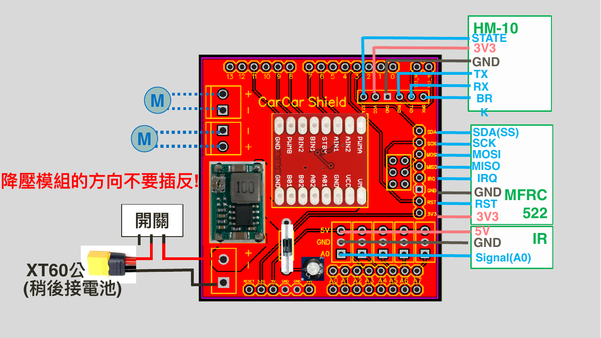

# NTUEE CarCar Shield PCB (自走車專用雙層擴充板)

國立臺灣大學「電資工程入門設計與實作」課程自走車控制器硬體優化與模組化擴充板專案。  
由課程助教自主使用 EasyEDA 繪製電路原理圖與雙層 PCB 佈局（Layout），徹底解決長年困擾學生的杜邦線接觸不良、大電流換向噪訊干擾微控制器重啟等硬體痛點，將組車與除錯時間大幅縮短 60%。

---

## 視覺與佈局展示 (PCB Layout & Schematics)

### 雙層 PCB 走線圖 (Top & Bottom Layers)

| 頂層走線與絲印 (Top Layer - Red) | 底層走線與鋪銅 (Bottom Layer - Blue) |
| :---: | :---: |
|  |  |

### 電路原理圖概覽 (Schematic Overview)


### 引腳定義與接線規範 (Slide 48 Pinout Mapping)


---

## 核心硬體規格與設計亮點

1. **大電流與電源地迴路抗雜訊隔離（Noise Immunity & Star Grounding）**
   - **星形單點接地（Star Grounding）**：將 TB6612FNG 馬達大電流接地路徑與 Arduino Mega 弱電訊號地平面完全分流，杜絕地彈（Ground Bounce）與換向突波。
   - **電源濾波與退耦**：板載多階電解電容與高頻瓷片退耦電容，消除馬達反電動勢（Back-EMF）對邏輯電路之干擾。

2. **高效率開關降壓電源模組整合**
   - 整合 DSN-MINI-360 / MP2307 降壓開關電源模組，將外部 7.4V~12V 鋰電池輸入降壓至穩定 5V 系統供電，避免 Arduino 板載 LDO 過熱降頻。

3. **模組化防呆介面整合**
   - **驅動單元**：板載 TB6612FNG 雙通道 H 橋直流馬達驅動晶片，支援 PWM 速度調控與高精度正反轉向。
   - **感測與通訊**：
     - 5 組紅外線循跡感測器（IR Sensors，A0–A4）專用端子排針。
     - HM-10 藍牙通訊模組（UART 序列埠通訊）。
     - RC522 RFID 讀卡模組（SPI 通訊協定：SCK, MISO, MOSI, SDA）。
     - 超音波避障模組與伺服馬達（Servo）專用排針。

---

## 系統引腳對應表 (Pinout Mapping)

| 模組 / 功能 | 訊號名稱 | Arduino Mega 2560 引腳 | 說明 |
| :--- | :--- | :--- | :--- |
| **馬達驅動 A (左輪)** | PWMA / AIN1 / AIN2 | D2, D3, D4 | PWM 速度控制與方向邏輯 |
| **馬達驅動 B (右輪)** | PWMB / BIN1 / BIN2 | D7, D5, D6 | PWM 速度控制與方向邏輯 |
| **馬達待命控制** | STBY | D8 | 高電位使能驅動輸出 |
| **紅外線循跡感測器** | S1 ~ S5 | A0, A1, A2, A3, A4 | 5 點循跡類比/數位讀取 |
| **藍牙模組 (HM-10)** | TXD / RXD | TX3 (D14) / RX3 (D15) | 硬體 Serial3 串列通訊 |
| **RFID 讀卡 (RC522)** | SCK / MISO / MOSI / SDA | D52, D50, D51, D53 | 硬體 SPI 高速通訊 |

---

## 倉庫檔案結構 (File Directory)

```text
carcar-shield-pcb/
├── README.md                               <-- 專案說明文件與硬體規格
├── hardware/
│   ├── Gerber_carcar-PCB_v3.zip            <-- 工廠洗板用 Gerber 製造檔案 (已通過 DRC)
│   ├── Schematic_carcar-PCB.pdf            <-- 高解析度向量電路原理圖
│   ├── PCB_Top_Layer.pdf                   <-- PCB 頂層走線與絲印圖 (PDF)
│   ├── PCB_Bottom_Layer.pdf                <-- PCB 底層走線圖 (PDF)
│   └── EasyEDA_Schematic.json              <-- EasyEDA 原始工程設計檔
├── docs/
│   ├── CarCar_Assembly_Guide_Complete.pdf  <-- 助教自編組裝指引與排錯投影片 (完整 57 頁 PDF)
│   └── CarCar_Assembly_and_PCB_Guide.pdf   <-- 助教自編組裝指引與排錯投影片 (核心 2 頁精選版)
└── images/
    ├── pcb_top.png                         <-- 頂層走線預覽圖
    ├── pcb_bottom.png                      <-- 底層走線預覽圖
    ├── schematic_preview.png               <-- 原理圖預覽圖
    └── pinout_slide48.png                  <-- Slide 48 完整引腳規範圖
```

---

## 製板規格 (Fabrication Details)

- **基材**：FR-4
- **層數**：2 層板（Double-Layer）
- **板厚**：1.6 mm
- **外層銅厚**：1 oz
- **表面工藝**：有鉛/無鉛噴錫 (HASL)
- **相容平台**：Arduino Mega 2560 Form Factor
